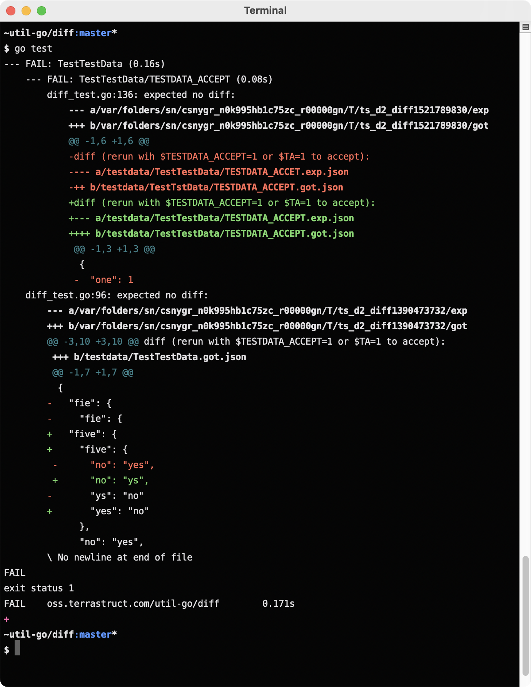
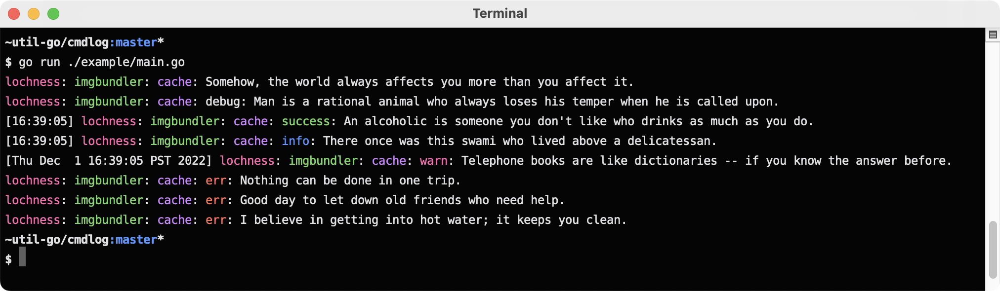

# util-go

Terrastruct's general purpose go libraries.

See https://pkg.go.dev/oss.terrastruct.com/util-go for docs.

If there's enough external demand for a single package to be split off into its
own repo from this collection we will. Feel free to open an issue to request.

<!-- toc -->
- <a href="#diff" id="toc-diff">./diff</a>
- <a href="#assert" id="toc-assert">./assert</a>
- <a href="#xtesting" id="toc-xtesting">./xtesting</a>
- <a href="#xdefer" id="toc-xdefer">./xdefer</a>
- <a href="#cmdlog" id="toc-cmdlog">./cmdlog</a>
- <a href="#xterm" id="toc-xterm">./xterm</a>
- <a href="#xos" id="toc-xos">./xos</a>
- <a href="#xrand" id="toc-xrand">./xrand</a>
- <a href="#xcontext" id="toc-xcontext">./xcontext</a>
- <a href="#xjson" id="toc-xjson">./xjson</a>
- <a href="#go2" id="toc-go2">./go2</a>
- <a href="#xbrowser" id="toc-xbrowser">./xbrowser</a>
- <a href="#xexec" id="toc-xexec">./xexec</a>
- <a href="#xhttp" id="toc-xhttp">./xhttp</a>
- <a href="#xmain" id="toc-xmain">./xmain</a>

## Package Index

godoc is the canonical reference but we've provided this index as the godoc UI is frankly
garbage after the move to pkg.go.dev. It's nowhere near as clear and responsive as the old
UI. If this feedback reaches the authors of pkg.go.dev, please revert the UI back to what
it was with godoc.org.

### [./diff](./diff)

diff providers functions to diff strings, files and general Go values with git diff.

### [./assert](./assert)

assert provides test assertion helpers. It integrates with [./diff](#diff) to display
beautiful diffs.

note: `TestdataJSON` is extremely useful.

### [./xtesting](./xtesting)

xtesting provides non assertion testing helpers. Currently only `RunCases`.

- Strings
- Files
- Runes
- JSON
- Testdata
- TestdataJSON

### [./xdefer](./xdefer)

xdefer annotates all errors returned from a function transparently.

### [./cmdlog](./cmdlog)

cmdlog implements color leveled logging for command line tools.

`cmdlog` supports arbitrary randomly colored prefixes just like
[terrastruct/ci](https://github.com/terrastruct/ci).

Example is in [./cmdlog/example/main.go](./cmdlog/example/main.go).

See [./cmdlog/cmdlog_test.go](./cmdlog/cmdlog_test.go) for further usage.

You can log in tests with `NewTB`.

- `$COLOR` is obeyed to force enable/disable colored output.
- `$DEBUG` is obeyed to enable/disable debug logs.

### [./xterm](./xterm)

xterm implements outputting formatted text to a terminal.

### [./xos](./xos)

xos provides OS helpers.

### [./xrand](./xrand)

xrand provides helpers for generating useful random values.
We use it mainly for generating inputs to tests.

### [./xcontext](./xcontext)

xcontext implements indispensable context helpers.

### [./xjson](./xjson)

xjson implements basic JSON helpers.

### [./go2](./go2)

go2 contains general utility helpers that should've been in Go. Maybe they'll be in Go 2.0.

### [./xbrowser](./xbrowser)

xbrowser enables opening a user's GUI browser to a URL.

### [./xexec](./xexec)

xexec provides exec helpers.

### [./xhttp](./xhttp)

xhttp provides HTTP helpers.

### [./xmain](./xmain)

xmain implements helpers for building CLI tools.
