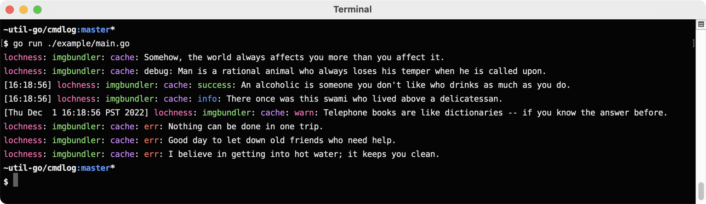

# cmdlog



`cmdlog` implements colored leveled logging for command line tools.

`cmdlog` supports arbitrary randomly colored prefixes just like
[terrastruct/ci](https://github.com/terrastruct/ci).

```go
l := cmdlog.New(xos.NewEnv(os.Environ()), os.Stderr)
l = l.WithCCPrefix("lochness")
l = l.WithCCPrefix("imgbundler")
l = l.WithCCPrefix("cache")

l.NoLevel.Println("Somehow, the world always affects you more than you affect it.")

l.SetDebug(true)
l.Debug.Println("Man is a rational animal who always loses his temper when he is called upon.")

l.SetDebug(false)
l.Debug.Println("You can never trust a woman; she may be true to you.")

l.SetTS(true)
l.Success.Println("An alcoholic is someone you don't like who drinks as much as you do.")
l.Info.Println("There once was this swami who lived above a delicatessan.")

l.SetTSFormat(time.UnixDate)
l.Warn.Println("Telephone books are like dictionaries -- if you know the answer before.")

l.SetTS(false)
l.Error.Println("Nothing can be done in one trip.")
```

Output is the screenshot above. You can run the example yourself. It's in
[./example/main.go](./example/main.go).

See [./cmdlog_test.go](./cmdlog_test.go) for further usage.

You can log in tests with `NewTB`.

You may also find the [./xterm](./xterm) package useful for outputting formatted text to the
terminal.

- `$COLOR` is obeyed to force enable/disable colored output.
- `$DEBUG` is obeyed to enable/disable debug logs.
